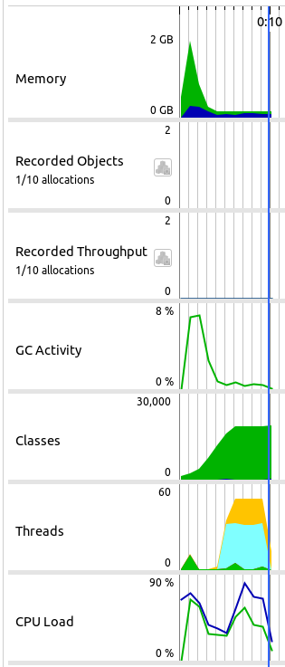
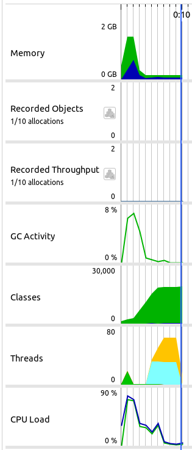

# redis_distributed_lock
코프링 + Redis를 이용한 분산락을 구현

### 개발환경
* Java 17
* Kotlin 1.8.22
* Spring Boot 3.1.3
* Gradle 8.0
* docker 20.10.17
* docker-compose 2.6.1
* (Optinal) Jprofiler 14

### 테스트 방식
1. 락을 사용하지 않은 상태에서 동시성 이슈 확인
2. 스핀락을 사용해서 동시성 이슈 해결 확인
3. Redisson을 이용한 PUB/SUB방식으로 동시성 이슈 해결 확인

### 테스트 결과
* 스핀락 사용시 Profile 

  
* Redisson 사용시 Profile 

### 결론
분산 애플리케이션에서 Redis를 이용한 락을 획득하는 방법을 구현해봤다. 
스핀락의 경우 간단하게 구현이 가능하지만, CPU 사용량이 많아지므로 Redisson을 이용한 PUB/SUB 방식을 추천한다.

### TODO
AOP를 이용해 락 획득 및 Unlock을 구현한다.
